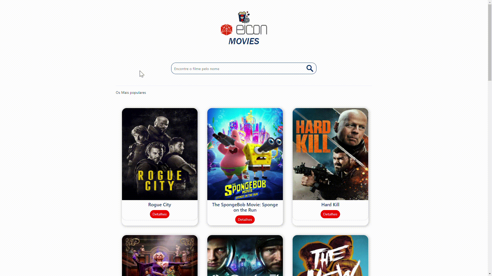
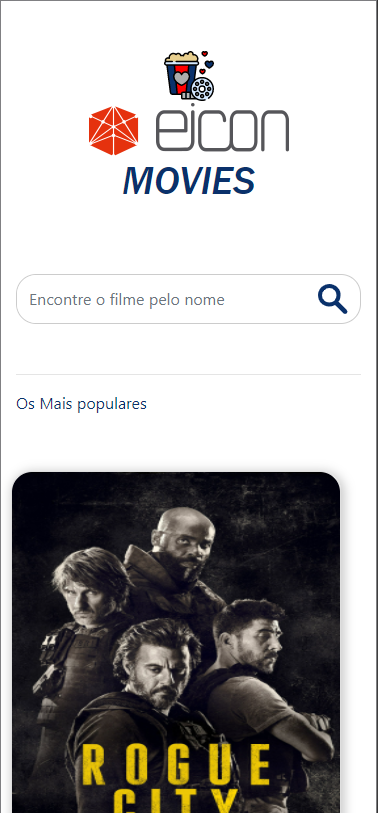
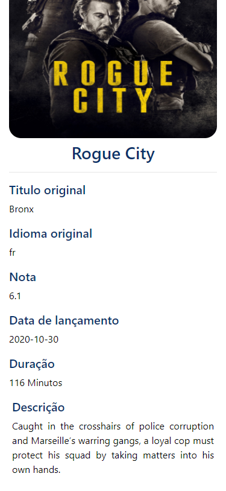

# Challenge Front End EICON

## Description

The goal of the challenge is to develop an application that makes it possible to search for films and check details of each one.

## Preview

***Desktop***

  

 
***Mobile*** 

   *Home-mobile*

 
 
 
   *Details-mobile*
 
 

## Technologies Used
- used to populate the screen a Rest API from [TMDB](https://www.themoviedb.org/documentation/api) indicated by [EICON](http://www.eicon.com.br).

- This project was generated with [Angular CLI](https://github.com/angular/angular-cli) version 10.2.0.

- Bootstrap used as CSS library.

- NPM (Node Package Management).

- GIT as versioning controller.

- Used the concept of Mobile First (for responsiveness). 

## First step clone repository
Come this [way](https://github.com/Ivan-Vidal/Test-Front-EICON)

## Second step Install dependencies

Run `npm install` for install al dependencies of project.

## third step Development server

Run `ng serve` for a dev server. Navigate to `http://localhost:4200/`. The app will automatically reload if you change any of the source files.

## Further help

To get more help on the Angular CLI use `ng help` or go check out the [Angular CLI README](https://github.com/angular/angular-cli/blob/master/README.md).
